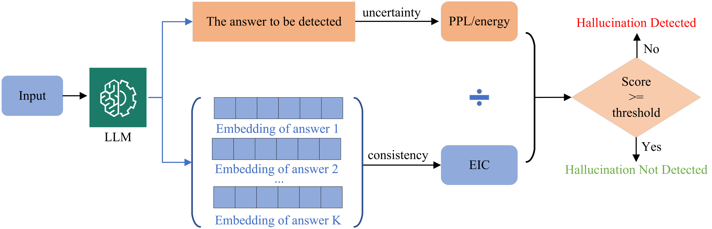

# Beyond Output Confidence: Epistemic-Aware Hallucination Detection with Answer-Level Signals
This repository contains code for our paper **Beyond Output Confidence: Epistemic-Aware Hallucination Detection with Answer-Level Signals**, which has been accepted to **ACL 2026** (findings).



## Code

Run `AIC.ipynb`.

## Citation

```bash
@article{hu2024novo,
  title={Beyond Output Confidence: Epistemic-Aware Hallucination Detection with Answer-Level Signals},
  author={Li, Jieran and Hu, Xiuyuan and Zhao, Yang and Sun, Dongbiao and Zhang, Hao},
  journal={Annual Meeting of the Association for Computational Linguistics (ACL)},
  year={2026}
}
```
